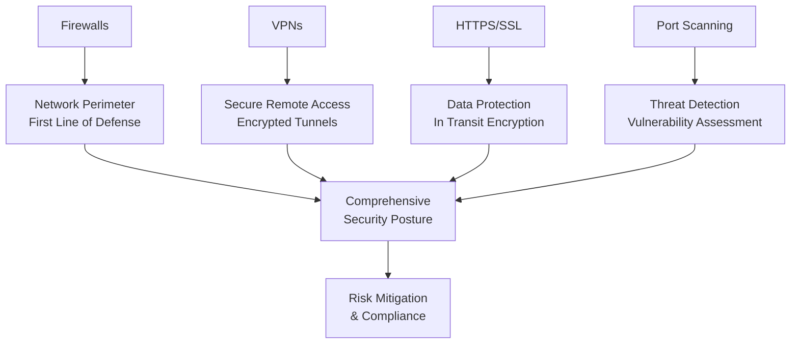

# Cybersecurity Internship Learning Journey

## 🌟 Overview

During my cybersecurity internship, I've transformed from a beginner with theoretical knowledge to someone with practical skills across multiple security domains. This document summarizes my learning journey and how these critical concepts interconnect to form a comprehensive security framework.

---

## 📚 Core Concepts Learned

### 1. **Network Security Fundamentals**

**What I Knew Before:** Basic theory about networks  
**What I Learned:**

- Practical firewall configuration (iptables & Windows Firewall)
- Real-world implementation of network segmentation
- Traffic analysis and rule optimization
- How different firewall types serve specific purposes

### 2. **Secure Remote Access (VPNs)**

**What I Knew Before:** VPNs provide secure connections  
**What I Learned:**

- Hands-on experience with OpenVPN and WireGuard setup
- PKI management and certificate authority operations
- Tunnel configuration and encryption protocols
- Troubleshooting real-world connection issues

### 3. **Web Security (HTTPS/SSL)**

**What I Knew Before:** HTTPS means secure websites  
**What I Learned:**

- Certificate generation and management
- Apache/Nginx SSL configuration
- Let's Encrypt automation
- Security headers implementation (HSTS, CSP)
- Mixed content issues and solutions

### 4. **Network Reconnaissance (Scanning)**

**What I Knew Before:** Port scanning exists  
**What I Learned:**

- Multiple scanning techniques with Nmap
- Script writing for custom scans (bash & Python)
- Stealth scanning methodologies
- Service enumeration and version detection
- Output analysis and interpretation

---

## 🔗 How These Concepts Connect

### The Security Ecosystem

### Practical Implementation Flow

1. **Assessment** → Port scanning identifies vulnerabilities
2. **Protection** → Firewalls restrict unauthorized access
3. **Encryption** → HTTPS protects data in transit
4. **Access Control** → VPNs enable secure remote connections
5. **Monitoring** → Continuous scanning detects new threats

---

## 🛠️ Tools & Technologies Mastered

| Category           | Tools Gained Experience With         |
| ------------------ | ------------------------------------ |
| **Firewalls**      | iptables, Windows Firewall, UFW      |
| **VPN Solutions**  | OpenVPN, WireGuard, IPsec            |
| **Web Security**   | Let's Encrypt, Certbot, OpenSSL      |
| **Scanning Tools** | Nmap, Netcat, custom bash scripts    |
| **Monitoring**     | Wireshark, tcpdump, logging analysis |

---

## 💡 Key Insights Gained

### 1. **Defense in Depth is Crucial**

- No single solution provides complete protection
- Layered security (firewalls + VPNs + HTTPS) creates resilience
- Each layer addresses different attack vectors

### 2. **Automation is Essential**

- Manual processes don't scale in security operations
- Scripting skills dramatically increase efficiency
- Automated scanning and certificate renewal prevent human error

### 3. **Visibility is Security**

- You can't protect what you can't see
- Regular scanning provides necessary network visibility
- Monitoring helps detect anomalies early

### 4. **Encryption Everywhere**

- Data protection shouldn't be optional
- HTTPS and VPNs should be standard practice
- Encryption prevents eavesdropping and data theft

---

## 🎯 Real-World Applications

### Project 1: Small Business Security Setup

**Challenge:** Secure a local business network with remote access  
**Solution Implemented:**

- Configured iptables firewall with strict rules
- Set up OpenVPN for remote employee access
- Implemented HTTPS with Let's Encrypt on web servers
- Created automated scanning scripts for ongoing monitoring

### Project 2: Vulnerability Assessment

**Challenge:** Identify security gaps in existing infrastructure  
**Solution Implemented:**

- Conducted comprehensive Nmap scans
- Identified unnecessary open ports
- Recommended firewall rule changes
- Verified HTTPS implementation across services

---

## 📈 Skills Development Progress

| Skill Area                 | Before Internship     | After Internship                  |
| -------------------------- | --------------------- | --------------------------------- |
| **Firewall Configuration** | Theoretical knowledge | Hands-on implementation           |
| **VPN Setup**              | Basic understanding   | Full deployment capability        |
| **SSL/TLS Management**     | Concept awareness     | Practical certificate management  |
| **Network Scanning**       | Simple ping tests     | Advanced vulnerability assessment |
| **Scripting for Security** | Limited experience    | Custom tool development           |

---

## 🔮 Future Learning Path

### Short-Term Goals (Next 3 Months)

- [ ] Deepen intrusion detection system (IDS) knowledge
- [ ] Learn SIEM solutions implementation
- [ ] Practice penetration testing methodologies
- [ ] Study cloud security fundamentals

### Long-Term Goals (6-12 Months)

- [ ] Obtain Security+ certification
- [ ] Learn advanced threat hunting techniques
- [ ] Develop expertise in incident response
- [ ] Explore security automation with Python

---

## 🙏 Acknowledgments

This internship provided the perfect environment to bridge theory with practice. The hands-on experience with real security tools and scenarios has been invaluable. I now understand how different security components work together to create a robust defense strategy and feel confident implementing basic security measures in various environments.

The journey from knowing _what_ security tools exist to understanding _how_ and _why_ to implement them has been transformative. I'm excited to continue building on this foundation and contributing to the cybersecurity field.

---

_This learning summary represents the practical knowledge gained during my internship. The skills and connections between concepts shown here form the foundation of my growing cybersecurity expertise._

**Intern:** [Your Name]  
**Date:** $(date +%Y-%m-%d)  
**Status:** Ready for new challenges! 🚀
